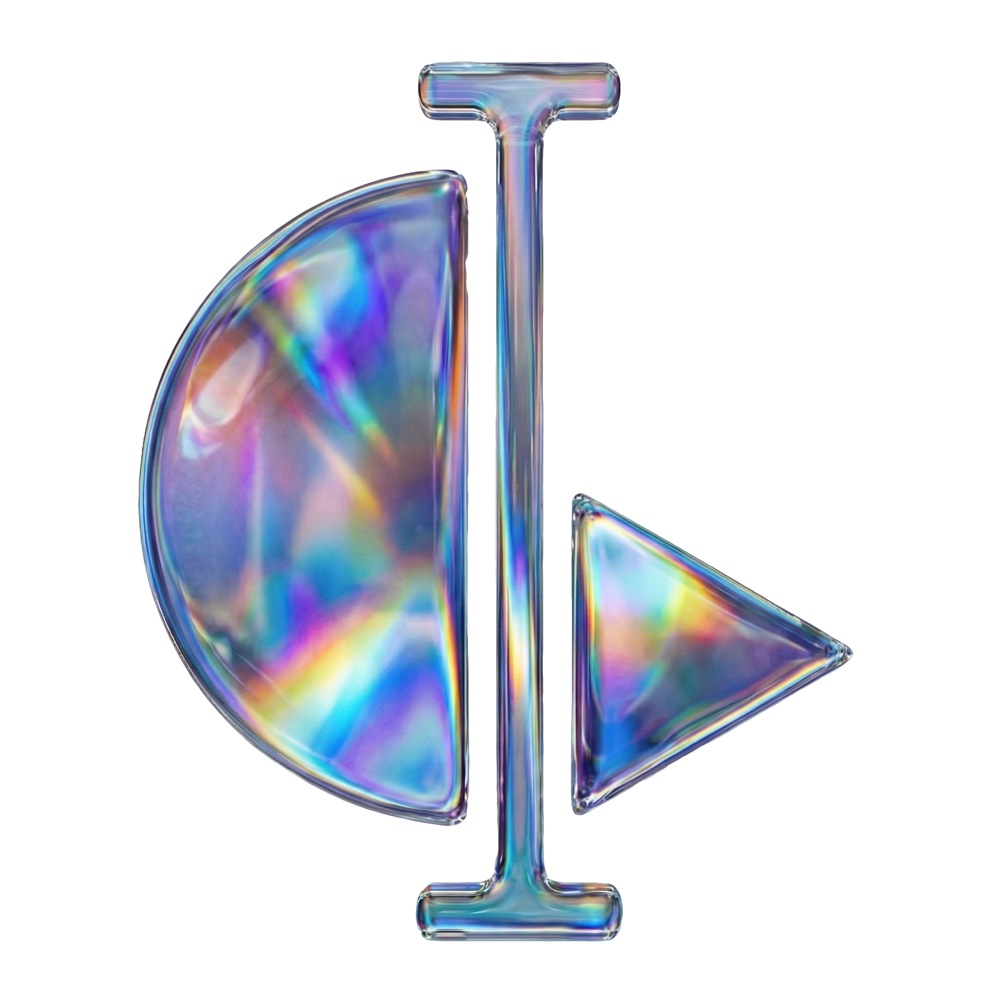

  

# Unity x Scope Toolkit

A Unity toolkit for creating **real-time AI-stylized video experiences** using [Scope](https://github.com/ScopeFoundry/Scope) pipelines via WebRTC streaming.

## What It Does

Captures gameplay footage (with depth extraction and character masking), streams it to a RunPod-hosted Scope API, and displays AI-transformed output in real-time. Supports multiple pipelines, dynamic prompts based on player state, interactive NPC chat via Google Gemini, and location-based prompt zones.

---

## Requirements

| Requirement | Details |
|-------------|---------|
| **Unity** | 6000.0.5812+ with Universal Render Pipeline |
| **RunPod** | Scope endpoint (see [Pipeline Selection](#pipeline-selection) for GPU requirements) |
| **Gemini API Key** | [Get free key](https://aistudio.google.com/app/apikey) (for NPC chat) |

---

## Quick Setup

1. **Clone & Open** in Unity Hub
2. **Import Required Assets:**
   - [Starter Assets - Third Person](https://assetstore.unity.com/packages/essentials/starter-assets-thirdperson-updates-in-new-charactercontroller-pa-196526) from Package Manager → My Assets
   - Click **Import TMP Essentials** if prompted
3. **Open** `Assets/Scenes/Default Scene.unity`
4. **Configure API Keys** in the Setup Screen UI or Inspector:
   - `DaydreamAPIManager` → RunPod URL
   - `GeminiChatManager` → Gemini API Key
5. **Press Play**

---

## Pipeline Selection

Select a pipeline from the **Pipeline Preset** dropdown on the `DaydreamAPIManager` inspector. Unity will automatically load the selected pipeline on the server when you press Play.

| Pipeline | ID | VRAM | Best For |
|----------|----|------|----------|
| **LongLive** | `longlive` | ~20 GB | General-purpose, smooth prompt transitions |
| **StreamDiffusion V2** | `streamdiffusionv2` | ~20 GB | Lowest latency, optimized for V2V |
| **MemFlow** | `memflow` | ~20 GB | Temporal consistency over long sessions |
| **Krea Realtime Video** | `krea-realtime-video` | ~32 GB | Highest quality (14B model, FP8) |

> **Important:** Each pipeline's model files must be downloaded on the server before first use. Run the pipeline once through the Scope web UI to trigger the download, then you can switch freely from Unity.

### Resolution Presets

Use the **Resolution Preset** dropdown to pick a resolution. Select **Custom** to enter arbitrary values. Lower resolutions are faster; higher resolutions need more VRAM.

> **Important:** Resolutions need to be divisible by 16!

---

## Key Scripts

### Core Managers (`Assets/Scripts/`)

| Script | Purpose |
|--------|---------|
| `DaydreamAPIManager.cs` | WebRTC streaming to RunPod, parameter updates via DataChannel |
| `PromptManager.cs` | Combines prefix + action + suffix, auto-updates based on player state |
| `GeminiChatManager.cs` | Google Gemini API integration for NPC conversations |
| `InputSwitcher.cs` | Manages input sources, UI modes (Start/Gameplay/Chat) |

### Prompt Zones

| Script | Purpose |
|--------|---------|
| `PrefixChanger.cs` | Changes prompt prefix when player enters zone |
| `SuffixChanger.cs` | Changes prompt suffix when player enters zone |
| `PromptReplacer.cs` | Replaces entire prompt + noise scale in zone |
| `CacheReset.cs` | Resets AI generation cache on zone entry |
| `CharacterChat.cs` | NPC chat trigger with custom AI personality |

### Depth & Visualization

| Script | Purpose |
|--------|---------|
| `DepthColorToTexture.cs` | Dual-camera depth extraction with character masking |
| `OpenPoseSkeletonRenderer.cs` | Skeleton visualization for AI guidance |
| `MinimapToggle.cs` | Top-down minimap mode |

---

## Keyboard Controls

| Key | Action |
|-----|--------|
| `1` | Toggle video input source |
| `2` | Toggle minimap mode |
| `3` | Toggle OpenPose skeleton |
| `0` | Reset API cache |
| `Tab` | Toggle parameter UI |
| `Space` | Start game (from start screen) |
| `F` | Start NPC chat (when near character) |
| `Esc` | Exit chat mode |
| `WASD` | Move character |
| `Q/E` | Rotate camera |
| `R` | Reset camera |

---

## APIs Required

| API | Purpose | Where to Get |
|-----|---------|--------------|
| **RunPod Scope** | Real-time video-to-video AI | Deploy Scope on RunPod |
| **Google Gemini** | NPC chat conversations | [Google AI Studio](https://aistudio.google.com/app/apikey) |

---

## Editor Tools

- **Daydream → Create WebRTC-Compatible RenderTexture** - Creates textures with correct B8G8R8A8_SRGB format

---

## Documentation

See `.github/copilot-instructions.md` for detailed API documentation and architecture overview.

---

## License

Part of [Scope Workshop 25](https://github.com/ScopeFoundry/Scope). Third-party assets (Starter Assets) must be obtained separately from the Unity Asset Store.